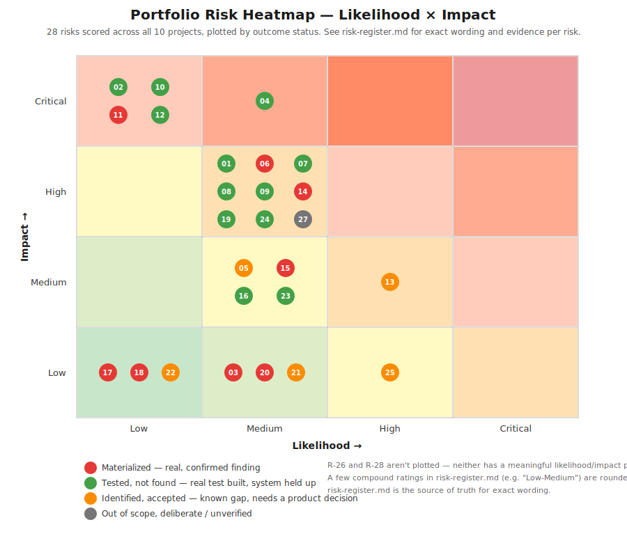

# Portfolio Risk Register

**Author:** Florencia Palmisano
**Purpose:** A single, cross-portfolio view of every quality risk I scored before testing began, and — critically — which ones turned out to be real. A risk register that never gets checked against actual findings is just a list of guesses; this one closes that loop for all 10 projects.

**Scoring model:** Likelihood and Impact are each rated Low / Medium / High / Critical. Risk Level = the higher of the two, adjusted up one step when both are Medium or above (a Medium/Medium risk with a plausible path to real harm gets treated as High, not averaged down). **Status** shows what actually happened once testing ran.

## How to read the Status column

- **Materialized** — this risk was a real, confirmed finding, not a hypothetical.
- **Tested, not found** — I built a real test for this risk and it passed; the risk was real enough to warrant a test, but the system held up.
- **Identified, accepted** — a known gap the app doesn't address; documented as a product decision to make, not automated around silently.
- **Out of scope, deliberate** — a risk I chose not to test against for a stated reason (legal, environment, non-idempotent state).

---

## Data & business-logic integrity

| ID | Project | Risk | Likelihood | Impact | Level | Status | Evidence |
|----|---------|------|:---:|:---:|:---:|---|---|
| R-01 | [01](../01-ecommerce-automationexercise) | Cart total miscalculated | Medium | High | High | Tested, not found | Cart-total assertions pass; a real product-id duplicate-rendering bug was caught and fixed in the test itself before it could mask this |
| R-02 | [04](../04-banking-parabank) | Transfer debits one account without crediting the other | Low | Critical | High | Tested, not found | Balance reconciliation asserted post-transfer on both accounts, not just a confirmation banner |
| R-03 | [04](../04-banking-parabank) | Zero-amount transfer silently accepted | Medium | Low-Medium | Medium | **Materialized** | $0 transfer accepted without rejection — flagged for a product-owner call, since some systems intentionally allow $0 "verify these accounts are linked" transfers |
| R-04 | [03](../03-healthcare-cura) | Confirmation screen shows different data than submitted | Medium | Critical | Critical | Tested, not found (after a false-negative scare) | `getConfirmedFacility()` initially had a bad selector assuming a table layout that never existed — fixed before it could hide a real mismatch |
| R-05 | [03](../03-healthcare-cura) | A past date is accepted for a new appointment | Medium | Medium | Medium | **Identified, accepted** | The app does not enforce this; documented as an exploratory finding requiring a product decision, not silently coded around |
| R-06 | [05](../05-travel-blazedemo) | Confirmation page shows the wrong route/city | Medium | High | High | **Materialized** | Purchase-page heading found hardcoded to a fixed route regardless of what was actually searched |
| R-07 | [10](../10-productivity-todomvc) | Completing a task doesn't update the active-item count | Medium | High | High | Tested, not found | Exact counts asserted, not surface checkmark appearance |
| R-08 | [10](../10-productivity-todomvc) | A filter shows tasks it shouldn't | Medium | High | High | Tested, not found | Active/Completed filters asserted against exact expected subsets |
| R-09 | [08](../08-ecommerce-demoblaze) | UI cart total diverges from what the API actually stored | Medium | High | High | Tested, not found | UI and the real public REST API checked side by side, not just the UI in isolation |

## Authentication & authorization

| ID | Project | Risk | Likelihood | Impact | Level | Status | Evidence |
|----|---------|------|:---:|:---:|:---:|---|---|
| R-10 | [01](../01-ecommerce-automationexercise) | Login accepts invalid credentials | Low | Critical | High | Tested, not found | — |
| R-11 | [04](../04-banking-parabank) | Login accepts an invalid password for a valid username | Low | Critical | **Critical** | **Materialized** | Confirmed via raw `curl` — the live endpoint returns `302 Found` regardless of password correctness. Broken authentication, OWASP A07:2021. **Highest-confidence security finding in this portfolio.** |
| R-12 | [07](../07-hr-orangehrm) | Invalid login is accepted | Low | Critical | High | Tested, not found | Clean pass — see R-16 |
| R-13 | [02](../02-ecommerce-saucedemo) | A known-bad seeded account (`problem_user`) ships in a release unnoticed | High (by design) | Medium | High | **Identified, accepted (partial)** | Login success is asserted across all 6 seeded accounts; the *specific* known defects behind `problem_user`/`performance_glitch_user` are not yet individually asserted — flagged as the next deepening pass on this project |

## Security posture (headers, cookies, CORS)

| ID | Project | Risk | Likelihood | Impact | Level | Status | Evidence |
|----|---------|------|:---:|:---:|:---:|---|---|
| R-14 | [08](../08-ecommerce-demoblaze) | API reflects request Origin + allows credentials (CORS misconfiguration) | Medium | High | **High** | **Materialized — most severe finding in this portfolio** | Sending `Origin: https://evil.example.com` returns that exact origin back in `access-control-allow-origin`, combined with `access-control-allow-credentials: true` — a well-known CORS anti-pattern that would let any site make authenticated, credentialed requests on behalf of a logged-in user |
| R-15 | [04](../04-banking-parabank) | Session cookie missing `SameSite`/`Secure` | Medium | Medium | Medium | **Materialized** | Confirmed via response header inspection |
| R-16 | [07](../07-hr-orangehrm) | Missing security headers / weak cookie flags | Medium | Medium | Medium | Tested, not found | Full HSTS, CSP, and Secure+HttpOnly+SameSite cookies present — the one fully clean security pass in this portfolio, reported as a positive finding, not skipped for lack of a bug to write up |
| R-17 | [01](../01-ecommerce-automationexercise) | Missing HSTS / CSP / stack-disclosure headers | Low–Low-Medium | Low | Low | **Materialized (informational–low)** | Reported against the third-party site; not fixable from this side, documented for completeness |
| R-18 | [05](../05-travel-blazedemo) | Missing security headers | Low-Medium | Low-Medium | Low-Medium | **Materialized (informational-low)** | Same disposition as R-17 |

## Availability & performance

| ID | Project | Risk | Likelihood | Impact | Level | Status | Evidence |
|----|---------|------|:---:|:---:|:---:|---|---|
| R-19 | [05](../05-travel-blazedemo) | Funnel breaks or slows under light concurrent load | Medium | High | High | Tested, not found (baseline) | 40-sample JMeter run, 0 errors, ~190ms average response time in last verified baseline |
| R-20 | [05](../05-travel-blazedemo) | Shared public infrastructure rate-limits repeated CI load runs | High (environment) | Low (not a product defect) | Low | **Materialized — correctly classified as environment noise** | A later run hit real `429`s after several same-day CI executions; CI gate deliberately changed from zero-tolerance to a 5% error-rate threshold to reflect real performance-testing practice |
| R-21 | [04](../04-banking-parabank) | Shared public instance intermittently bot-checked (Cloudflare) | Medium (environment) | None (not a product defect) | — | **Identified, accepted as environment risk** | Documented explicitly rather than silently retried away |
| R-22 | [01](../01-ecommerce-automationexercise) | CI runner IP occasionally served a bot-check challenge | Low (environment) | None | — | **Identified, accepted as environment risk** | Confirmed via `curl` re-run moments later returning a clean response |

## Usability / UI patterns automation tends to skip

| ID | Project | Risk | Likelihood | Impact | Level | Status | Evidence |
|----|---------|------|:---:|:---:|:---:|---|---|
| R-23 | [06](../06-legacy-tools-theinternet) | A destructive action's `confirm()` dialog is silently dismissed by tooling, hiding a regression | Medium | Medium | Medium | Tested, not found | Native dialogs handled explicitly rather than auto-dismissed |
| R-24 | [06](../06-legacy-tools-theinternet) | File upload silently fails | Medium | Medium-High | Medium | Tested, not found | — |
| R-25 | [06](../06-legacy-tools-theinternet) | Drag-and-drop pattern is inherently flaky in automation | High | Low (tooling, not product) | Low | **Identified, accepted** | Documented explicitly as a known-flaky pattern rather than chased to artificial 100% green |

## Legal, ethical & execution-honesty risk

| ID | Project | Risk | Likelihood | Impact | Level | Status | Evidence |
|----|---------|------|:---:|:---:|:---:|---|---|
| R-26 | [09](../09-mobile-appium) | Automating a real commercial app without authorization | — | High (legal/ethical) | High | **Out of scope, deliberate** | Avoided entirely by targeting Appium's own official `ApiDemos-debug.apk` sample app instead of a branded app |
| R-27 | [09](../09-mobile-appium) | Native-dialog handling silently blocks automation (and, in production, the user) | Medium | High | High | **Out of scope, deliberate — unverified** | No emulator/Appium server available in this environment; the suite was written but not executed, and the final report says so directly rather than implying coverage that isn't there |
| R-28 | [01](../01-ecommerce-automationexercise) | Non-idempotent third-party payment form makes checkout unsafe to automate repeatedly | High | — | — | **Out of scope, deliberate** | Kept manual by design; flagged as needing to move to P1-automated before any real production release with a real payment gateway |

---

## What this register tells me about the portfolio as a whole

Of the risks scored **High or Critical** across all 10 projects, **3 materialized into real, confirmed findings**: Parabank's broken authentication (R-11), DemoBlaze's CORS misconfiguration (R-14), and BlazeDemo's hardcoded confirmation route (R-06). None of the three were found by accident — each came from a test built specifically because the risk was scored high enough to justify writing a real assertion instead of a happy-path check. That's the return on doing risk scoring honestly before writing test cases.
