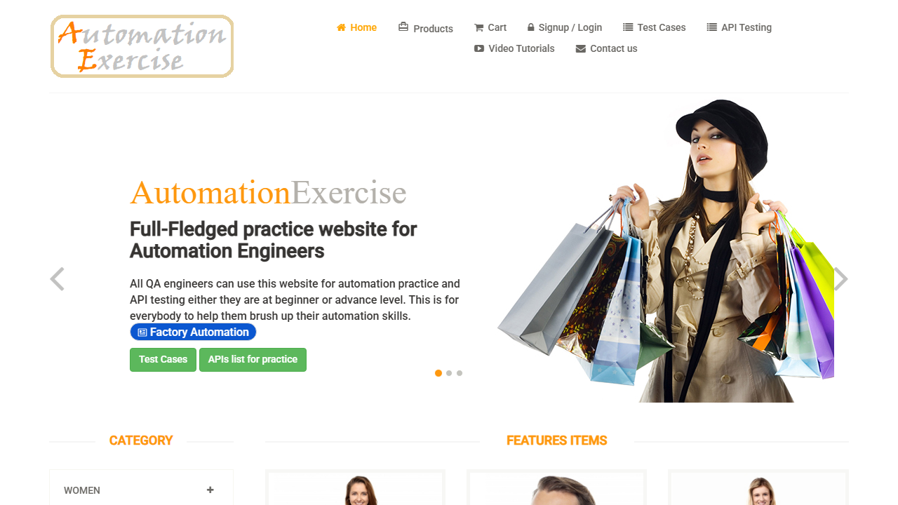
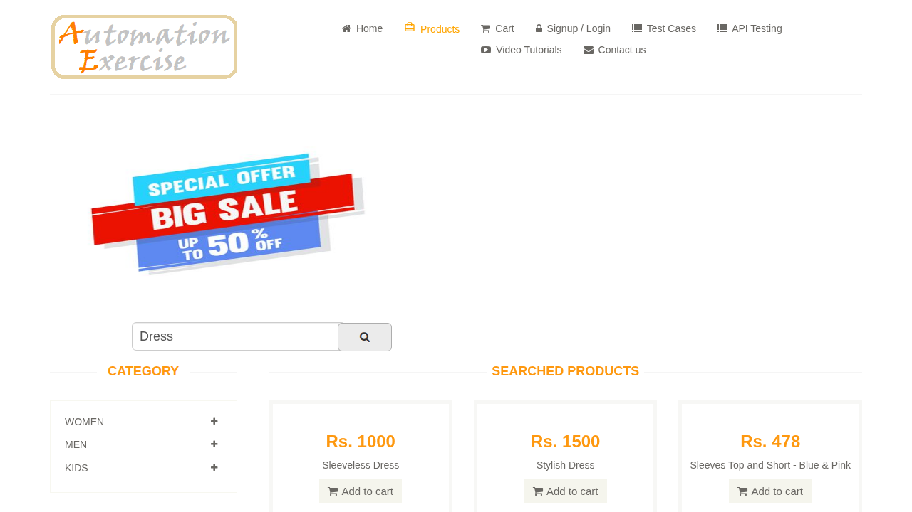
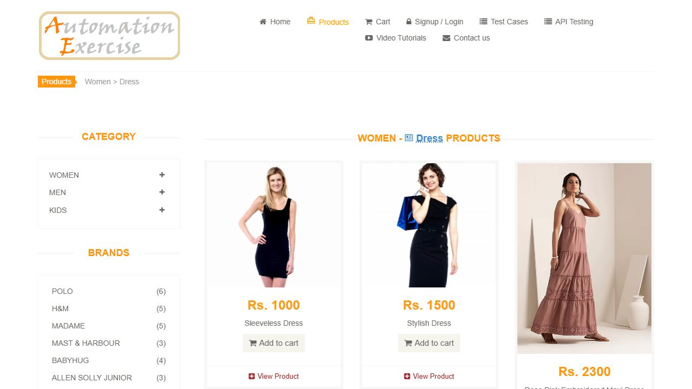
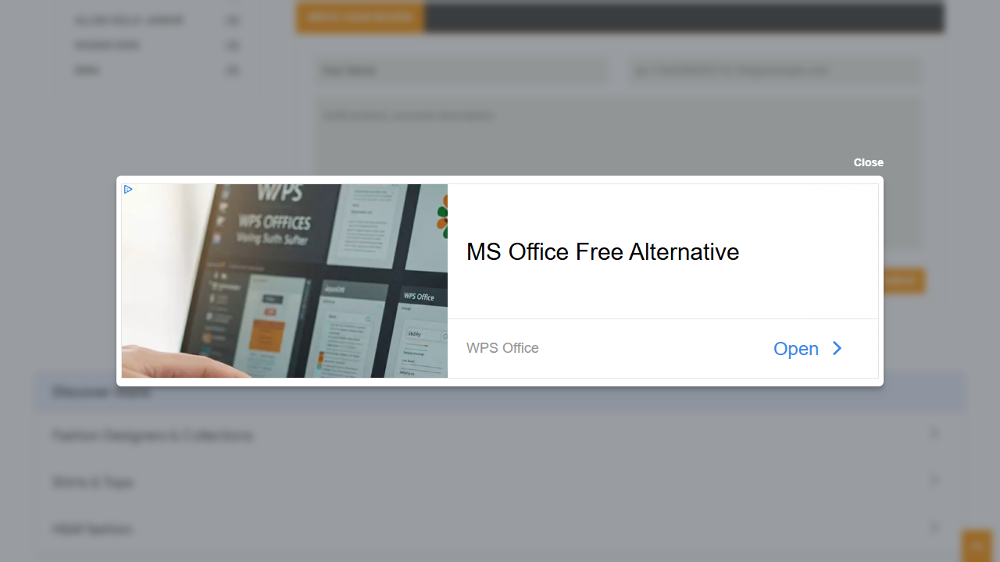

# Project 01 — E-commerce | [automationexercise.com](https://automationexercise.com)

**Domain:** E-commerce | **Primary tool:** Playwright (TypeScript) | **Legacy system?** No — modern server-rendered app

Full-lifecycle QA project against a live public e-commerce sandbox, following this portfolio's standard 7-folder shape (see [`00-qa-strategy-and-leadership/project-template.md`](../00-qa-strategy-and-leadership/project-template.md)).

## Contents

| Folder | What's in it |
|--------|--------------|
| [`01-planning-strategy`](01-planning-strategy) | Business value & risk analysis, direction/scope decisions, test plan |
| [`02-test-cases`](02-test-cases) | 26 test cases (CSV, Excel-readable) + full 26-scenario traceability matrix — 100% scenario coverage |
| [`03-automation`](03-automation) | 4 Playwright specs (purchase journey, login security boundary, catalog & engagement, cart persistence) + shared page objects/helpers |
| [`04-security-api`](04-security-api) | Postman collection (14/14 API scenarios), basic security checks (3 findings), and accessibility findings |
| [`05-performance`](05-performance) | k6 staged-load test across 4 API endpoints — real run results in [`last-run-results.md`](05-performance/last-run-results.md) |
| [`06-evidence`](06-evidence) | 20 real screenshots, one per automated test case |
| [`07-reports`](07-reports) | Sprint 01 + sprint 02 reports, final report |

## Evidence

*Home page.*

*Search results — confirms the search feature returns real, matching products.*

*Category navigation (TC-18) — sidebar filtering lands on the correct, matching product set.*

*TC-21's review-submission evidence — captured mid-run with a real Google Vignette ad interstitial covering the form, exactly the interception behavior documented below.*

20 real screenshots in total cover every automated test case — see [`06-evidence/README.md`](06-evidence/README.md) for the full index.

## Real CI/automation findings

- **Ad network intercepts click-driven navigation (real, reproducible):** a Google Vignette full-page interstitial intermittently swallows a click meant to follow a real link, leaving the URL at `...#google_vignette` instead of navigating. Confirmed with a minimal repro before fixing; see [`07-reports/sprint-02-report.md`](07-reports/sprint-02-report.md) for detail and the [`helpers/navigation.ts`](03-automation/helpers/navigation.ts) workaround.
- **Inline ad blocks a real button:** an AdSense placement intermittently renders directly on top of the product-review "Submit" button — Playwright's own actionability check confirms the ad, not the button, would receive the click. A real user could be blocked the same way.
- **Real bug found & fixed (sprint 01):** product id 1's "Add to cart" link renders **twice** in the DOM (hover overlay + static link) — caused a Playwright strict-mode violation, fixed with `.first()`.
- **3 real accessibility findings** (generic alt text at scale, an unreachable CTA, no visible keyboard-focus indicator) — see [`04-security-api/security-checks.md`](04-security-api/security-checks.md).
- **Known intermittent failure mode (infrastructure, not code):** automationexercise.com occasionally serves a bot-protection challenge to GitHub Actions' runner IPs. Confirmed via a saved screenshot, not assumed — see the CI badge on the [root README](../README.md) for the current run's actual outcome.
