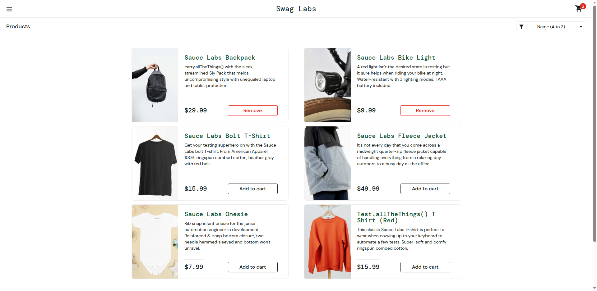
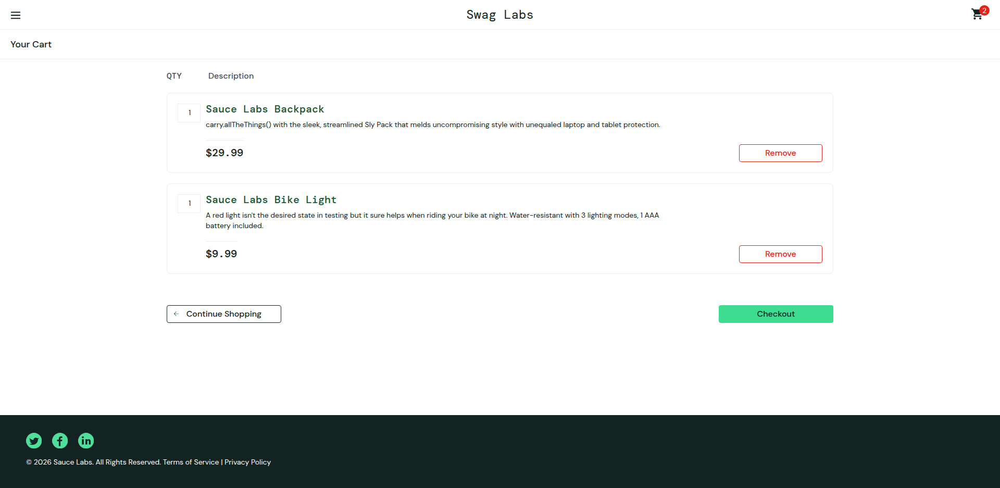

# Project 02 — E-commerce Web | [saucedemo.com](https://www.saucedemo.com) (Swag Labs)

**Domain:** E-commerce/retail | **Primary tools:** Selenium WebDriver + Java + TestNG | **Lifecycle coverage:** Planning → Automation → Reporting

Swag Labs is Sauce Labs' own official demo application, purpose-built for Selenium/automation practice — including several accounts deliberately seeded with bugs (`problem_user`, `performance_glitch_user`) to practice defect-finding.

This project intentionally uses **Java + TestNG** (the classic enterprise Selenium stack) rather than Playwright/TypeScript (used in [Project 01](../01-ecommerce-automationexercise)), to demonstrate range across the two most common automation ecosystems a QA team is likely to maintain.

## Contents

- [`test-plan.md`](test-plan.md) — scope and the seeded-bug accounts strategy
- `src/test/java/pages/` — Page Object Model (LoginPage, InventoryPage, CartPage, CheckoutPage)
- `src/test/java/tests/` — TestNG test classes
- `testng.xml` — suite definition (sequential — see [`report.md`](report.md) for why parallel execution was reverted)
- [`report.md`](report.md) — results, including the intentionally-seeded defects found on `problem_user`, and a 10-round log of real bugs this suite hit and fixed against the live site

## Evidence

Real screenshots captured during a GitHub Actions run against the live site (not mockups):


*Product catalog — `standard_user` view, all 6 seeded products rendering correctly.*


*Cart page after adding two products — correct names, prices and quantities.*

## Running

```bash
mvn test
```

Requires a local ChromeDriver managed by Selenium Manager (bundled with Selenium 4.6+, no manual driver download needed).
